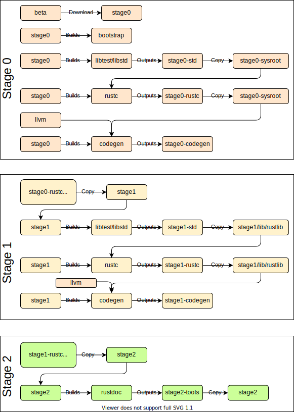

# 编译器自举

本小节与自举过程有关。

运行`x.py`时，您将看到如下输出：

```txt
Building stage0 std artifacts
Copying stage0 std from stage0
Building stage0 compiler artifacts
Copying stage0 rustc from stage0
Building LLVM for x86_64-apple-darwin
Building stage0 codegen artifacts
Assembling stage1 compiler
Building stage1 std artifacts
Copying stage1 std from stage1
Building stage1 compiler artifacts
Copying stage1 rustc from stage1
Building stage1 codegen artifacts
Assembling stage2 compiler
Uplifting stage1 std
Copying stage2 std from stage1
Generating unstable book md files
Building stage0 tool unstable-book-gen
Building stage0 tool rustbook
Documenting standalone
Building rustdoc for stage2
Documenting book redirect pages
Documenting stage2 std
Building rustdoc for stage1
Documenting stage2 whitelisted compiler
Documenting stage2 compiler
Documenting stage2 rustdoc
Documenting error index
Uplifting stage1 rustc
Copying stage2 rustc from stage1
Building stage2 tool error_index_generator
```

在这里可以更深入地了解`x.py`的各个阶段：



请记住，此图只是一个简化，即`rustdoc`可以在不同阶段构建，当传递诸如`--keep-stage`之类的标志或存在和宿主机类型不同的目标时，该过程会有所不同。

下表列出了各种阶段操作的输出：

| Stage 0 动作                                | Output                                       |
| ------------------------------------------- | -------------------------------------------- |
| 提取`beta`                                  | `build/HOST/stage0`                          |
| `stage0` 构建 `bootstrap`                   | `build/bootstrap`                            |
| `stage0` 构建 `libstd`                      | `build/HOST/stage0-std/TARGET`               |
| 复制 `stage0-std` (HOST only)               | `build/HOST/stage0-sysroot/lib/rustlib/HOST` |
| `stage0` 使用`stage0-sysroot`构建 `rustc`   | `build/HOST/stage0-rustc/HOST`               |
| 复制 `stage0-rustc `（可执行文件除外）      | `build/HOST/stage0-sysroot/lib/rustlib/HOST` |
| 构建 `llvm`                                 | `build/HOST/llvm`                            |
| `stage0` 使用`stage0-sysroot`构建 `codegen` | `build/HOST/stage0-codegen/HOST`             |
| `stage0` 使用`stage0-sysroot`构建 `rustdoc` | `build/HOST/stage0-tools/HOST`               |

`--stage=0` 到此为止。

| Stage 1 动作                                     | Output                               |
| ------------------------------------------------ | ------------------------------------ |
| 复制 (提升) `stage0-rustc` 可执行文件到 `stage1` | `build/HOST/stage1/bin`              |
| 复制 (提升) `stage0-codegen` 到 `stage1`         | `build/HOST/stage1/lib`              |
| 复制 (提升) `stage0-sysroot` 到 `stage1`         | `build/HOST/stage1/lib`              |
| `stage1` 构建 `libstd`                           | `build/HOST/stage1-std/TARGET`       |
| 复制 `stage1-std` (HOST only)                    | `build/HOST/stage1/lib/rustlib/HOST` |
| `stage1` 构建 `rustc`                            | `build/HOST/stage1-rustc/HOST`       |
| 复制 `stage1-rustc` （可执行文件除外）           | `build/HOST/stage1/lib/rustlib/HOST` |
| `stage1` 构建 `codegen`                          | `build/HOST/stage1-codegen/HOST`     |

`--stage=1` 到此为止。

| Stage 2 动作                          | Output                                                       |
| ------------------------------------- | ------------------------------------------------------------ |
| 复制 (提升) `stage1-rustc` 可执行文件 | `build/HOST/stage2/bin`                                      |
| 复制 (提升) `stage1-sysroot`          | `build/HOST/stage2/lib and build/HOST/stage2/lib/rustlib/HOST` |
| `stage2` 构建 `libstd` (除 HOST?)     | `build/HOST/stage2-std/TARGET`                               |
| 复制 `stage2-std` (非 HOST 目标)      | `build/HOST/stage2/lib/rustlib/TARGET`                       |
| `stage2` 构建 `rustdoc`               | `build/HOST/stage2-tools/HOST`                               |
| 复制 `rustdoc`                        | `build/HOST/stage2/bin`                                      |

`--stage=2` 到此为止。

注意，`x.py`使用的约定是：

- “stage N 产品”是由stage N编译器产生的制品。
- “stage (N+1)编译器”由“stage N 产品”组成。
- “--stage N”标志表示使用stage N构建。

简而言之，_stage 0使用stage0编译器创建stage0产品，随后将其提升为stage1_。

每次编译任何主要产品（`std`和`rustc`）时，都会执行两个步骤。
当`std`由N级编译器编译时，该`std`将链接到由N级编译器构建的程序（包括稍后构建的`rustc`）。 stage (N+1)编译器还将使用它与自身链接。
如果有人认为stage (N+1)编译器“只是”我们正在使用阶段N编译器构建的另一个程序，那么这有点直观。 
在某些方面，可以将`rustc`（二进制文件，而不是`rustbuild`步骤）视为少数`no_core`二进制文件之一。

因此，“stage0 std制品”实际上是下载的stage0编译器的输出，并且将用于stage0编译器构建的任何内容：
例如 `rustc`制品。 当它宣布正在“构建stage1 std制品”时，它已进入下一个自举阶段。 在以后的阶段中，这种模式仍在继续。

还要注意，根据stage的不同，构建主机`std`和目标`std`的情况有所不同（例如，在表格中看到stage2仅构建非主机`std`目标。
这是因为在stage2期间，主机`std`是从stage 1`std`提升过来的——
特别地，当宣布“ Building stage 1 artifacts”时，它也随后被复制到stage2中（编译器的`libdir `和`sysroot`））。

对于编译器的任何有用的工作，这个`std`都是非常必要的。
具体来说，它用作新编译的编译器所编译程序的`std`
（因此，当您编译`fn main() {}`时，它将链接到使用`x.py build --stage 1 src/libstd`编译的最后一个`std`）。

由stage0编译器生成的`rustc`链接到新构建的`libstd`，这意味着在大多数情况下仅需要对`std`进行cfg门控，以便`rustc`可以立即使用添加到std的功能。
添加后，无需进入下载的Beta。由`stage1/bin/rustc`编译器构建的`libstd`，也称“stage1 std”构件，不一定与该编译器具有ABI兼容性。
也就是说，`rustc`二进制文件很可能无法使用此`std`本身。
然而，它与`stage1/bin/rustc`二进制文件所构建的任何程序（包括其自身）都具有ABI兼容性，因此从某种意义上讲，它们是配对的。

这也是`--keep-stage 1 src/libstd`起作用的地方。 
由于对编译器的大多数更改实际上并未更改ABI，因此，一旦在阶段1中生成了`libstd`，您就可以将其与其他编译器一起使用。
如果ABI没变，那就很好了，不需要花费时间重新编译`std`。
`--keep-stage`假设先前的编译没有问题，然后将这些制品复制到适当的位置，从而跳过cargo调用。

我们首先构建`std`，然后构建`rustc`的原因基本上是因为我们要最小化`rustc`代码中的`cfg(stage0)`。
当前`rustc`总是与“新的”`std`链接，因此它不必关心std的差异。它可以假定std尽可能新。

我们需要两次构建它的原因是因为ABI兼容性。 Beta编译器具有自己的ABI，而`stage1/bin/rustc`编译器将使用新的ABI生成程序/库。
我们曾经要编译3次，但是由于我们假设ABI在代码库中是恒定的，
我们假定“stage2”编译器生成的库（由`stage1/bin/rustc`编译器产生）与`stage1/bin/rustc`编译器产生的库ABI兼容。
这意味着我们可以跳过最后一次编译 —— 只需使用`stage2/bin/rustc`编译器自身所使用的库。

这个`stage2/bin/rustc`编译器和`stage 1 {std, rustc}`一起被交付给最终用户。

## 环境变量

在自举过程中，使用了很多编译器内部的环境变量。 如果您尝试运行`rustc`的中间版本，有时可能需要手动设置其中一些环境变量。 否则，您将得到如下错误：

```text
thread 'main' panicked at 'RUSTC_STAGE was not set: NotPresent', src/libcore/result.rs:1165:5
```

如果`./stageN/bin/rustc`给出了有关环境变量的错误，那通常意味着有些不对劲
——或者您正在尝试编译例如`librustc`或`libstd`或依赖于环境变量的东西。 在极少数情况下，您才会需要在这种情况下调用`rustc`，
您可以通过在`x.py`命令中添加以下标志来找到环境变量值：`--on-fail=print-env`。